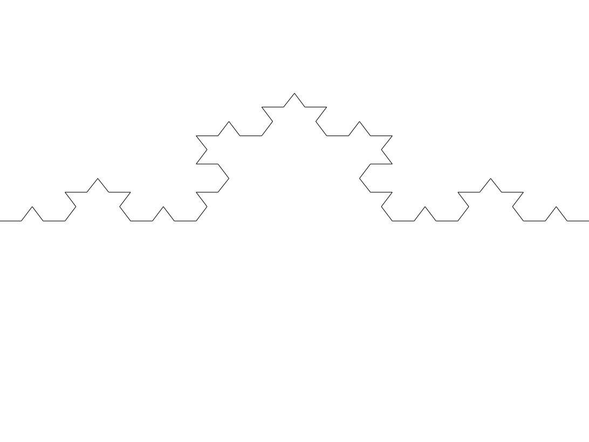

Koch
=========

Installation
------------

To run the code you will need the following dependencies:

-   The code is tested and run on python3.4
-   Imagemagick is used as image-viewer through the command "display".
-   Numpy is used for some math functions.
-   git http://it.wikipedia.org/wiki/Git_%28software%29

Mac (not tested)
----
-   Install mac ports https://www.macports.org/install.php
-   Install numpy,imagemagick, python 3.4 and git
        sudo port install imagemagick py34-scipy git
-   Run
        ./Kock.py

------
Inkscape or other vector graphics programs (adobe illustrator) can be useful to open the svg format.

To change the "rendering density" open the file Koch.py and change the following [lines](https://github.com/leonardoromor/Koch/blob/master/Korsh.py#L149-150).

This is the result for n=3.

